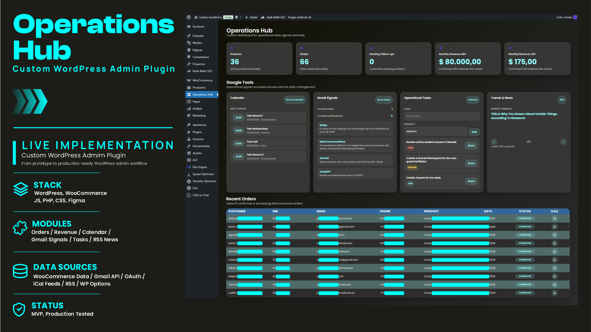

# Operations Hub

Custom WordPress admin plugin for operational data, signals and internal tools.

## Preview

### Current version — Google Tools and operational signals



### Initial version — WooCommerce operations dashboard


## Overview

Operations Hub is a custom WordPress admin plugin built to centralize operational data, workflow signals and internal management tools in a single dashboard.

The project started as a WooCommerce-focused dashboard for order tracking, revenue visibility and customer follow-up. It later evolved into a broader internal operations tool with Google Calendar signals, Gmail API integration, operational tasks and RSS-based news/market signals.

Instead of checking WooCommerce orders, Gmail, Calendar events and internal tasks across different screens, the plugin consolidates the most relevant operational information into one WordPress admin view.

## Features

- Custom WordPress admin dashboard
- Active WooCommerce product count
- Confirmed order count
- Monthly revenue tracking by currency
- Pending follow-up count
- Recent WooCommerce order table
- Custom checkout meta field support for DNI
- WhatsApp follow-up action per customer
- Google Calendar signals via private iCal feeds
- Gmail unread counters using Gmail API and OAuth
- Latest unread Gmail item preview
- Internal operational task manager
- RSS-based news and market signals slider
- Custom admin UI with separated template, assets and scripts
- Fallback behavior when WooCommerce or external data is unavailable

## Tech Stack

- WordPress
- WooCommerce
- PHP
- JavaScript
- CSS
- Figma
- Gmail API
- OAuth 2.0
- iCal / ICS feeds
- RSS feeds
- WordPress Options API
- Custom admin templates

## Plugin Structure

```text
woocommerce-command-center/
├── woocommerce-command-center.php
├── README.md
├── .gitignore
├── config/
│   ├── calendar-feeds.example.php
│   └── gmail-api.example.php
├── templates/
│   └── admin-dashboard.php
└── assets/
    ├── admin.css
    ├── admin.js
    ├── icons/
    │   └── whatsapp.svg
    └── screenshot/
        ├── dashboard-preview.png
        └── operation-hub-dashboard-preview-github.png
```
Private configuration files such as `config/calendar-feeds.php` and `config/gmail-api.php` are intentionally excluded from version control and replaced with example files for safe repository usage.

## Design Process

The dashboard interface was first drafted as a Figma prototype to define layout, visual hierarchy and UI direction before being implemented as a custom WordPress admin plugin.

## Data Sources

The plugin uses operational data from multiple sources:

- WooCommerce products
- WooCommerce orders
- WooCommerce order status
- WooCommerce order totals
- Billing data
- Custom checkout meta field: `user_identity_number`
- Google Calendar private iCal feeds
- Gmail API unread message queries
- RSS/news feeds
- WordPress Options API for internal tasks

## What the Dashboard Shows

The admin dashboard displays:

- Total active products
- Confirmed orders
- Monthly revenue by currency
- Pending follow-ups
- Latest confirmed or processing WooCommerce orders
- Customer contact data from WooCommerce orders
- Purchased item
- Order status
- WhatsApp follow-up action
- Upcoming Google Calendar events
- Gmail unread inbox and notification signals
- Latest unread Gmail items
- Internal operational tasks
- RSS-based news and market signals

## Notes

This plugin was built for a real WordPress/WooCommerce education platform and adapted to its operational workflow.

Sensitive customer/order data is not included in this repository. Screenshots used for portfolio purposes should hide personal information such as names, emails, phone numbers and DNI.

## Status

MVP / Live tested.
