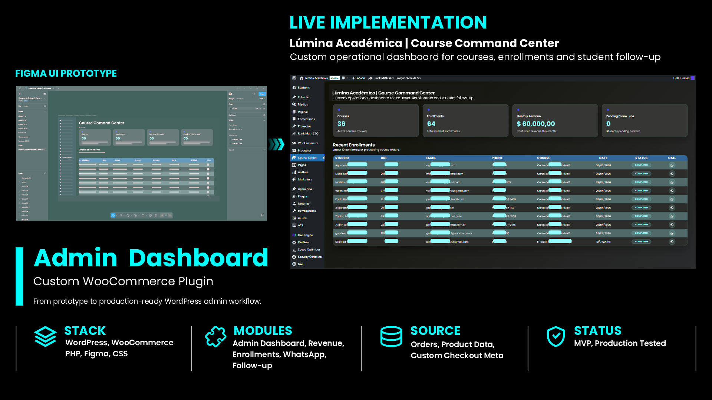

# WooCommerce Command Center

Custom WordPress/WooCommerce admin dashboard for centralizing order tracking, monthly revenue, customer follow-up actions and operational activity.

## Preview



## Overview

WooCommerce Command Center is a custom WordPress plugin that extends WooCommerce with a focused internal dashboard for store operations, order tracking, revenue visibility and customer follow-up.

Instead of checking orders, customers, products and follow-up actions across different WooCommerce screens, the plugin centralizes the most relevant operational data in one admin view.

## Features

- Custom WordPress admin dashboard
- Active WooCommerce product/product count
- Confirmed order count
- Monthly revenue calculation
- Pending follow-up count
- Recent order table
- Custom checkout meta field support for DNI
- Clean item names for variable products
- WhatsApp follow-up action per customer
- Fallback behavior when WooCommerce is inactive
- Custom admin UI with separated template and assets

## Tech Stack

- WordPress
- WooCommerce
- PHP
- HTML
- CSS
- Figma
- Custom admin templates

## Plugin Structure

```text
woocommerce-command-center/
├── woocommerce-command-center.php
├── README.md
├── .gitignore
├── templates/
│   └── admin-dashboard.php
└── assets/
    ├── admin.css
    └── icons/
        └── whatsapp.svg
```

## Design Process

The dashboard interface was first drafted as a Figma prototype to define layout, visual hierarchy and UI direction before being implemented as a custom WordPress admin plugin.

## Data Sources

The plugin uses WooCommerce data through native WooCommerce/WordPress APIs:

- WooCommerce products
- WooCommerce orders
- Order status
- Order totals
- Billing data
- Custom checkout meta field: `user_identity_number`

## What the Dashboard Shows

The admin dashboard displays:

- Total active products
- Confirmed orders
- Monthly revenue
- Pending follow-ups
- Latest 10 confirmed or processing WooCommerce orders
- Customer contact data from WooCommerce orders
- Purchased item
- Order status
- WhatsApp follow-up action

## Notes

This plugin was built for a real WordPress/WooCommerce education platform and adapted to its operational workflow.

Sensitive customer/order data is not included in this repository. Screenshots used for portfolio purposes should hide personal information such as names, emails, phone numbers and DNI.

## Status

MVP / Live tested.
